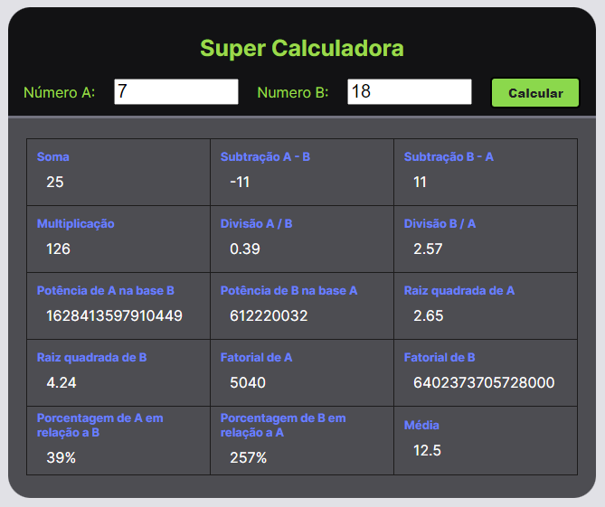

<h1 align="center"> Super Calculadora </h1>

Super calculadora que desenvolvi durante o Minicamp da XPE.

  <a href="#-tecnologias">Tecnologias</a>&nbsp;&nbsp;&nbsp;|&nbsp;&nbsp;&nbsp;
  <a href="#-projeto">Projeto</a>&nbsp;&nbsp;&nbsp;&nbsp;&nbsp;&nbsp;|&nbsp;&nbsp;&nbsp;
  <a href="#memo-licença">Licença</a>

  

 

   

## 🚀 Tecnologias

Esse projeto foi desenvolvido com as seguintes tecnologias:

- HTML
- CSS
- JavaScript

## 💻 Projeto

A Super Calculadora é uma aplicação que calcula as quatro operação matemáticas básicas, potência, raíz quadrada, fatorial, porcentagem e média entre dois número informados pelo usuário.

##  Licença

Esse projeto está sob a licença MIT.

---

